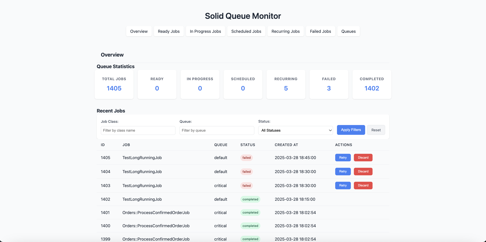
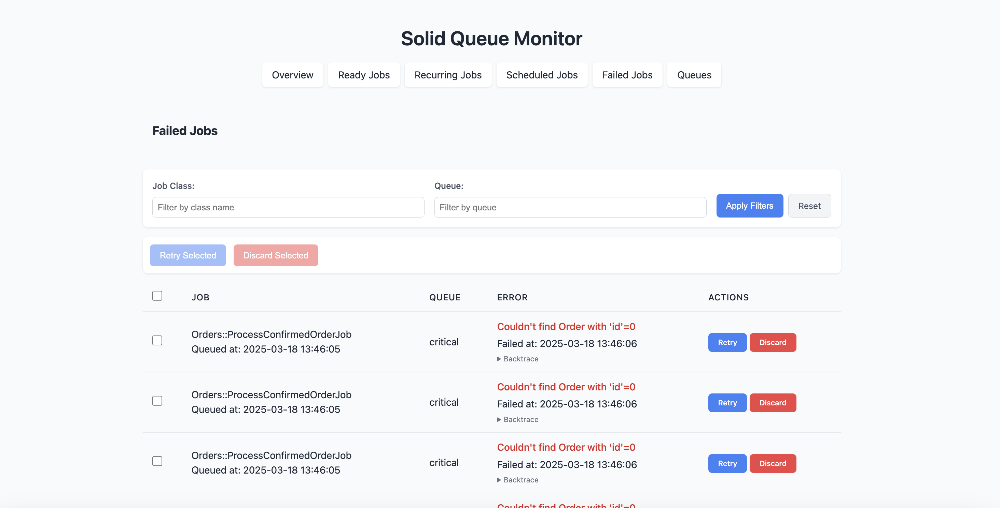

# SolidQueueMonitor

[](https://badge.fury.io/rb/solid_queue_monitor)
[](LICENSE)

A lightweight, zero-dependency web interface for monitoring Solid Queue background jobs in Ruby on Rails applications. Perfect for Rails API-only applications and traditional Rails apps.

## Key Advantages

- **Works in API-only Rails Applications**: Unlike other monitoring gems that require a full Rails application with asset pipeline or webpacker, SolidQueueMonitor works seamlessly in API-only Rails applications.
- **No External Dependencies**: No JavaScript frameworks, no CSS libraries, no additional gems required - just pure Rails.
- **Self-contained UI**: All HTML, CSS, and JavaScript are generated server-side, making deployment simple and reliable.
- **Minimal Footprint**: Adds minimal overhead to your application while providing powerful monitoring capabilities.
- **Rails 7 Compatible**: Fully compatible with Rails 7.1+ and the latest Solid Queue versions.

## Features

- **Dashboard Overview**: Get a quick snapshot of your queue's health with statistics on all job types
- **Ready Jobs**: View jobs that are ready to be executed
- **In Progress Jobs**: Monitor jobs currently being processed by workers
- **Scheduled Jobs**: See upcoming jobs scheduled for future execution
- **Recurring Jobs**: Manage periodic jobs that run on a schedule
- **Failed Jobs**: Track and debug failed jobs, with the ability to retry or discard them
- **Queue Management**: View and filter jobs by queue
- **Advanced Job Filtering**: Filter jobs by class name, queue, status, and job arguments
- **Quick Actions**: Retry or discard failed jobs directly from any view
- **Performance Optimized**: Designed for high-volume applications with smart pagination
- **Optional Authentication**: Secure your dashboard with HTTP Basic Authentication
- **Responsive Design**: Works on desktop and mobile devices
- **Zero Dependencies**: No additional JavaScript libraries or frameworks required

## Screenshots

### Dashboard Overview



### Failed Jobs



## Installation

Add this line to your application's Gemfile:

```ruby
gem 'solid_queue_monitor', '~> 0.3.0'
```

Then execute:

```bash
$ bundle install
```

After bundling, run the generator:

```bash
rails generate solid_queue_monitor:install
```

This will:

1. Create an initializer at `config/initializers/solid_queue_monitor.rb`
2. Add required routes to your `config/routes.rb`

## Configuration

You can configure Solid Queue Monitor by editing the initializer:

```ruby
# config/initializers/solid_queue_monitor.rb
SolidQueueMonitor.setup do |config|
  # Enable or disable authentication
  # By default, authentication is disabled for ease of setup
  config.authentication_enabled = false

  # Set the username for HTTP Basic Authentication (only used if authentication is enabled)
  config.username = 'admin'

  # Set the password for HTTP Basic Authentication (only used if authentication is enabled)
  config.password = 'password'

  # Number of jobs to display per page
  config.jobs_per_page = 25
end
```

### Authentication

By default, Solid Queue Monitor does not require authentication to access the dashboard. This makes it easy to get started in development environments.

For production environments, it's strongly recommended to enable authentication:

1. **Enable authentication**: Set `config.authentication_enabled = true` in the initializer
2. **Configure secure credentials**: Set `username` and `password` to strong values in the initializer

## Usage

After installation, visit `/solid_queue` in your browser to access the dashboard.

The dashboard provides several views:

- **Overview**: Shows statistics and recent jobs
- **Ready Jobs**: Jobs that are ready to be executed
- **Scheduled Jobs**: Jobs scheduled for future execution
- **Recurring Jobs**: Jobs that run on a recurring schedule
- **Failed Jobs**: Jobs that have failed with error details
- **Queues**: Distribution of jobs across different queues

### API-only Applications

For API-only Rails applications, SolidQueueMonitor works out of the box without requiring you to enable the asset pipeline or webpacker. This makes it an ideal choice for monitoring background jobs in modern API-based architectures.

### Job Filtering

You can filter jobs by:

- **Class Name**: Filter by job class name
- **Queue Name**: Filter by queue name
- **Job Arguments**: Search within job arguments using case-insensitive partial matching
- **Status**: Filter by job status (completed, failed, scheduled, pending)

This makes it easy to find specific jobs when debugging issues in your application.

## Use Cases

- **Production Monitoring**: Keep an eye on your background job processing in production environments
- **Debugging**: Quickly identify and troubleshoot failed jobs
- **Job Management**: Execute scheduled jobs on demand when needed
- **Performance Analysis**: Track job distribution and identify bottlenecks
- **DevOps Integration**: Easily integrate with your monitoring stack

## Compatibility

- **Ruby**: 3.1.6 or higher
- **Rails**: 7.1 or higher
- **Solid Queue**: 0.1.0 or higher

## Contributing

Contributions are welcome! Here's how you can contribute:

1. Fork the repository
2. Create your feature branch (`git checkout -b my-new-feature`)
3. Commit your changes (`git commit -am 'Add some feature'`)
4. Push to the branch (`git push origin my-new-feature`)
5. Create a new Pull Request

Please make sure to update tests as appropriate and follow the existing code style.

### Development

After checking out the repo, run `bin/setup` to install dependencies. Then, run `rake test` to run the tests. You can also run `bin/console` for an interactive prompt that will allow you to experiment.

## License

The gem is available as open source under the terms of the [MIT License](https://opensource.org/licenses/MIT).

## Code of Conduct

Everyone interacting in the SolidQueueMonitor project's codebases, issue trackers, chat rooms and mailing lists is expected to follow the [code of conduct](https://github.com/yourusername/solid_queue_monitor/blob/main/CODE_OF_CONDUCT.md).

## Related Projects

- [Solid Queue](https://github.com/rails/solid_queue) - The official Rails background job framework
- [Rails](https://github.com/rails/rails) - The web application framework
- [ActiveJob](https://github.com/rails/rails/tree/main/activejob) - Rails job framework
