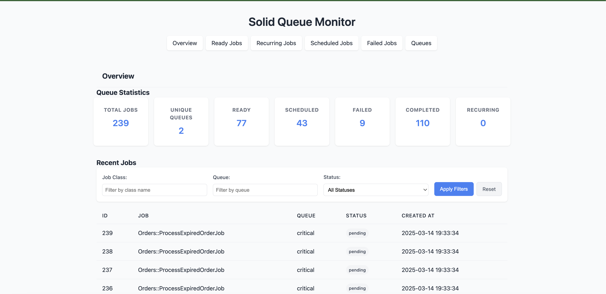
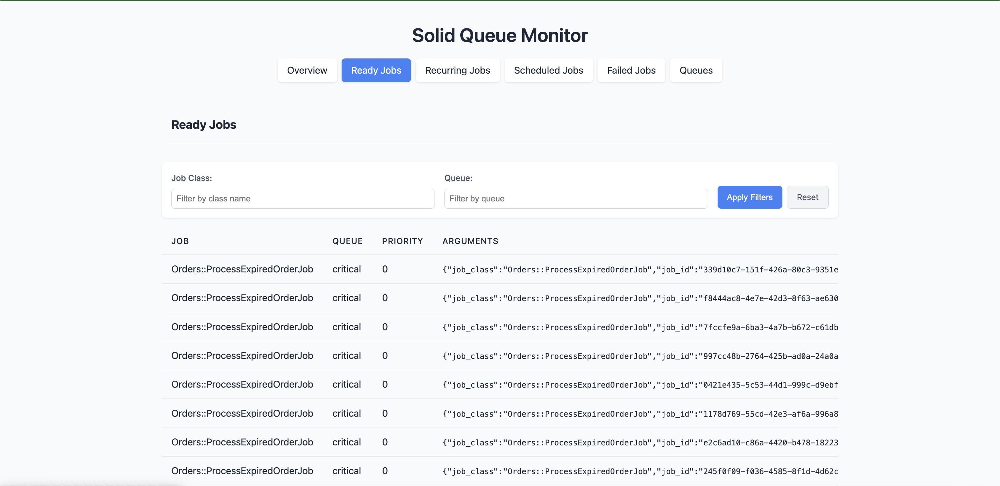

# SolidQueueMonitor

A lightweight, zero-dependency web interface for monitoring Solid Queue jobs in Rails applications.

## Key Advantages

- **Works in API-only Rails Applications**: Unlike other monitoring gems that require a full Rails application with asset pipeline or webpacker, SolidQueueMonitor works seamlessly in API-only Rails applications.
- **No External Dependencies**: No JavaScript frameworks, no CSS libraries, no additional gems required - just pure Rails.
- **Self-contained UI**: All HTML, CSS, and JavaScript are generated server-side, making deployment simple and reliable.
- **Minimal Footprint**: Adds minimal overhead to your application while providing powerful monitoring capabilities.

## Features

- **Dashboard Overview**: Get a quick snapshot of your job queue with statistics and counts
- **Job Filtering**: Filter jobs by class name, queue name, and status
- **Job Management**: Execute scheduled jobs on demand
- **Failed Job Inspection**: View detailed error information for failed jobs
- **Queue Monitoring**: Track job distribution across different queues
- **Pagination**: Navigate through large job lists with ease
- **Optional Authentication**: Secure your dashboard with HTTP Basic Authentication
- **Responsive Design**: Works on desktop and mobile devices
- **Zero Dependencies**: No additional JavaScript libraries or frameworks required

## Screenshots

### Dashboard Overview



### Recurring Jobs



## Installation

Add this line to your application's Gemfile:

```ruby
gem 'solid_queue_monitor'
```

Then execute:

```bash
$ bundle install
```

After bundling, run the generator:

```bash
rails generate solid_queue_monitor:install
```

This will:

1. Create an initializer at `config/initializers/solid_queue_monitor.rb`
2. Add required routes to your `config/routes.rb`

## Configuration

You can configure Solid Queue Monitor by creating an initializer:

```ruby
# config/initializers/solid_queue_monitor.rb
SolidQueueMonitor.setup do |config|
  # Enable or disable authentication
  # When disabled, no authentication is required to access the monitor
  config.authentication_enabled = false

  # Set the username for HTTP Basic Authentication (only used if authentication is enabled)
  config.username = 'admin'

  # Set the password for HTTP Basic Authentication (only used if authentication is enabled)
  config.password = 'password'

  # Number of jobs to display per page
  config.jobs_per_page = 25
end
```

### Authentication

By default, Solid Queue Monitor does not require authentication to access the dashboard. This makes it easy to get started in development environments.

If you want to enable authentication (recommended for production):

1. **Enable authentication**: Set `config.authentication_enabled = true` in the initializer
2. **Configure credentials**: Set `username` and `password` in the initializer (defaults are 'admin'/'password')

For production environments, it's strongly recommended to enable authentication and set secure credentials to prevent unauthorized access to your job management interface.

## Usage

After installation, visit `/solid_queue` in your browser to access the dashboard.

The dashboard provides several views:

- **Overview**: Shows statistics and recent jobs
- **Ready Jobs**: Jobs that are ready to be executed
- **Scheduled Jobs**: Jobs scheduled for future execution
- **Failed Jobs**: Jobs that have failed with error details
- **Queues**: Distribution of jobs across different queues

### API-only Applications

For API-only Rails applications, SolidQueueMonitor works out of the box without requiring you to enable the asset pipeline or webpacker. This makes it an ideal choice for monitoring background jobs in modern API-based architectures.

## Contributing

Contributions are welcome! Here's how you can contribute:

1. Fork the repository
2. Create your feature branch (`git checkout -b my-new-feature`)
3. Commit your changes (`git commit -am 'Add some feature'`)
4. Push to the branch (`git push origin my-new-feature`)
5. Create a new Pull Request

Please make sure to update tests as appropriate and follow the existing code style.

### Development

After checking out the repo, run `bin/setup` to install dependencies. Then, run `rake test` to run the tests. You can also run `bin/console` for an interactive prompt that will allow you to experiment.

## License

The gem is available as open source under the terms of the [MIT License](https://opensource.org/licenses/MIT).

## Code of Conduct

Everyone interacting in the SolidQueueMonitor project's codebases, issue trackers, chat rooms and mailing lists is expected to follow the [code of conduct](https://github.com/yourusername/solid_queue_monitor/blob/main/CODE_OF_CONDUCT.md).
